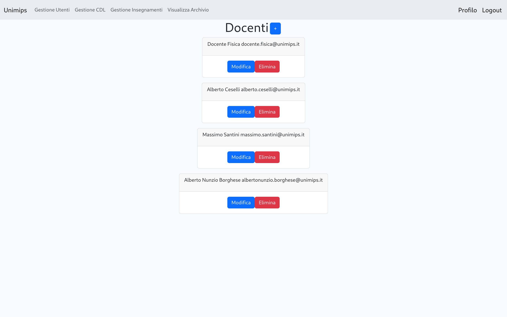
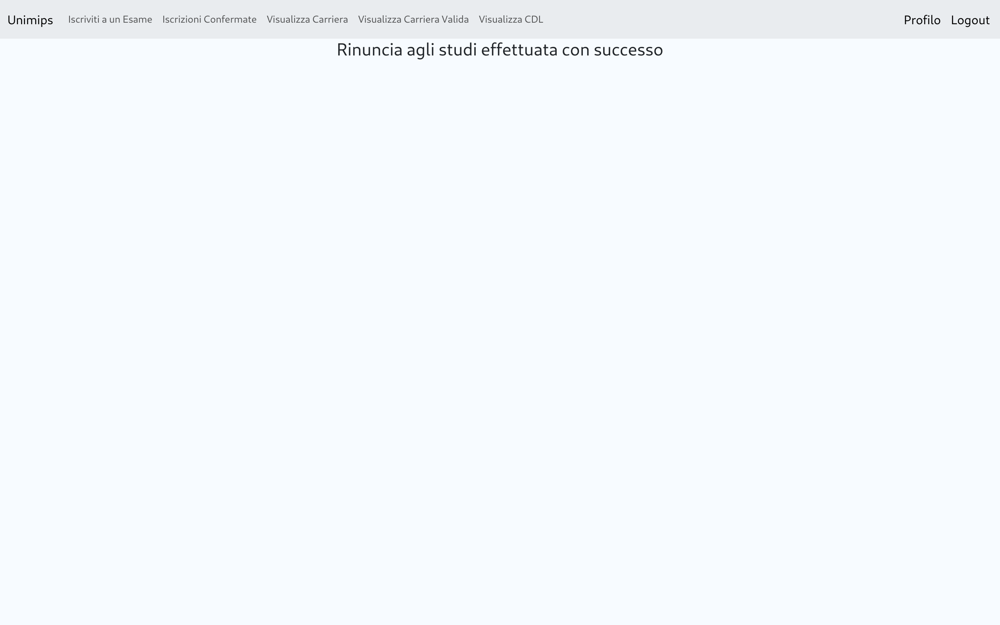

# Documentazione tecnica

## Indice

- [Requisiti e installazione](#requisiti-e-installazione)
- [Schema ER](#schema-er)
- [Schema Logico](#schema-logico)
- [Funzionalità](#funzionalità)
    - [Generali](#generali)
    - [Segreteria](#segreteria)
    - [Docente](#docente)
    - [Studente](#studente)
    - [Procedure, funzioni e trigger](#procedure-funzioni-e-trigger)
- [Struttura del progetto](#struttura-del-progetto)
    - [Struttura dei file](#struttura-dei-file)
    - [Views](#views)
    - [Controllers](#controllers)
    - [Routing](#routing)
    - [Interazione con il database](#interazione-con-il-database)
- [Prove di funzionamento](#prove-di-funzionamento)

## Requisiti e installazione

I requisiti e istruzioni per l'installazione e deploy possono essere trovati nel [manuale utente](./README.md)

## Schema ER


## Schema Logico


## Funzionalità

### Generali

- Login
- Logout
- Visualizzazione Profilo
    - Modifica Password
    - Rinuncia agli studi (solo se studente e con ancora esami mancanti)

### Segreteria

- Gesione Utenti (tutti gli utenti vengono creati con una password di default che può essere cambiata in ogni momento
  dalla segreteria e dall'utente stesso)
    - Studenti
        - Aggiunta
        - Modifica
        - Rimozione (trasferisce lo studente e le sue valutazioni nell'archivio. Se ha ancora esami mancanti risulta
          come rinuncia agli studi mentre se ha completato tutti gli esami del suo cdl risulta come laureato)
    - Docenti
        - Aggiunta
        - Modifica
        - Rimozione
    - Segretetari
        - Aggiunta
        - Modifica
        - Rimozione
- Gestione CDL
    - Aggiunta
    - Modifica (nome e tipo di laurea)
    - Rimozione
- Gesione Insegnamenti
    - Aggiunta
    - Modifica
        - Modifica delle propedeuticità (Aggiunta e rimozione)
    - Rimozione
    - Visualizza Archivio (Visualizza tutti gli studenti che hanno rinunciato agli studi o che hanno completato il loro
      cdl)
        - Mostra carriera
        - Mostra carriera valida

### Docente

- Insegnamenti
    - Aggiungi esame (selezione della data)
- Prossimi esami
    - Modifica (cambio data)
    - Elimina
- Esami passati
    - Visualizza valutazioni
    - Modifica valutazioni

### Studente

- Iscrizone agli esami (è possibile iscriversi a tutti gli esami al massimo del giorno seguente e solamente se sono
  rispettate le propedeuticità, altrimenti il pulsante di iscrizione è disabilitato)
- Iscrizioni confermate (gli esami a cui è ancora possibile iscriversi sono gli stessi da cui è possibile disiscriversi)
    - Cancella iscrizione
- Visualizza carriera
- Visualizza carriera valida
- Visualizza CDL (visualizza tutti gli insegnamenti di ogni corso di laurea e le loro propedeuticità)

### Procedure, funzioni e trigger

#### Procedure

- ``add_cdl(IN p_id_cdl character varying, IN p_nome character varying, IN p_tipo db_esami.tipo_laurea)``: aggiunge un
  cdl al database
- ``add_docente(IN p_nome character varying, IN p_cognome character varying, IN p_password character varying)``:
  aggiunge un docente al database
- ``add_esame(IN p_data date, IN p_id_insegnamento integer, IN p_id_docente integer)``: aggiunge un esame al database
- ``add_insegnamento(IN p_semestre integer, IN p_nome character varying, IN p_id_docente integer, IN p_id_cdl character varying, IN p_anno integer)``:
  aggiunge un insegnamento al database
- ``add_propedeutico(IN p_id_insegnamento integer, IN p_id_richiesto integer)``: aggiunge un esame propedeutico a un
  insegnamento
- ``add_segretario(IN p_nome character varying, IN p_cognome character varying, IN p_password character varying)``:
  aggiunge un segretario al database
- ``add_studente(IN p_nome character varying, IN p_cognome character varying, IN p_id_cdl character varying, IN p_password character varying)``:
  aggiunge uno studente al database
- ``delete_cdl(IN p_id_cdl character varying)``: elimina un cdl dal database
- ``delete_docente(IN p_id_docente integer)``: elimina un docente dal database
- ``delete_esame(IN p_id_esame integer)``: elimina un esame dal database
- ``delete_insegnamento(IN p_id_insegnamento integer)``: elimina un insegnamento dal database
- ``delete_iscrizione_esame(IN p_matricola integer, IN p_id_esame integer)``: elimina l'iscrizione di uno studente a un
  esame
- ``delete_propedeutico(IN p_id_insegnamento integer, IN p_id_richiesto integer)``: elimina un esame propedeutico da un
  insegnamento
- ``delete_segretario(IN p_id_segreteria integer)``: elimina un segretario dal database
- ``delete_studente(IN p_matricola integer)``: elimina uno studente dal database
- ``iscrivi_studente_a_esame(IN p_matricola integer, IN p_id_esame integer)``: iscrive uno studente a un esame
- ``update_cdl(IN p_id_cdl character varying, IN p_nome character varying, IN p_tipo db_esami.tipo_laurea)``: aggiorna
  un cdl nel database
- ``update_docente(IN p_id_docente integer, IN p_nome character varying, IN p_cognome character varying, IN p_email character varying, IN p_password character varying)``:
  aggiorna un docente nel database
- ``update_esame(IN p_id_esame integer, IN p_data date)``: aggiorna un esame nel database
- ``update_insegnamento(IN p_id_insegnamento integer, IN p_semestre integer, IN p_nome character varying, IN p_id_docente integer, IN p_id_cdl character varying, IN p_anno integer)``:
  aggiorna un insegnamento nel database
- ``update_segretario(IN p_id_segreteria integer, IN p_nome character varying, IN p_cognome character varying, IN p_email character varying, IN p_password character varying)``:
  aggiorna un segretario nel database
- ``update_studente(IN p_matricola integer, IN p_nome character varying, IN p_cognome character varying, IN p_email character varying, IN p_password character varying)``:
  aggiorna uno studente nel database
- ``update_user_password(IN p_id_utente integer, IN p_password character varying)``: aggiorna la password di un utente
- ``update_valutazione(IN p_id_esame integer, IN p_matricola integer, IN p_voto integer)``: aggiorna la valutazione di
  un esame per uno studente

#### Funzioni

- ``get_all_esami_iscritto(p_matricola integer)``: restituisce tutti gli esami a cui si è iscritto uno studente
- ``get_esame(p_id_esame integer)``: restituisce le informazioni di un esame
- ``get_esami_by_cdl(p_id_cdl character varying)``: restituisce tutti gli esami di un corso di laurea
- ``get_esami_futuri_by_id_docente(p_id_docente integer)``: restituisce tutti gli esami futuri tenuti da un docente
- ``get_esami_not_iscritto(p_matricola integer)``: restituisce tutti gli esami del proprio cdl a cui uno studente non si
  è iscritto e se ci sono propedeuticità mancanti per quell'esame
- ``get_esami_passati_by_id_docente(p_id_docente integer)``: restituisce tutti gli esami passati tenuti da un docente
- ``get_iscrizione_esame(p_matricola integer, p_id_esame integer)``: restituisce le informazioni dell'iscrizione di uno
  studente a un esame
- ``get_iscrizioni_by_id_esame(p_id_esame integer)``: restituisce tutte le iscrizioni a un esame
- ``get_next_esami_iscritto(p_matricola integer)``: restituisce i prossimi esami a cui uno studente si è iscritto
- ``get_numero_esami_mancanti(p_matricola integer)``: restituisce il numero di esami mancanti a uno studente per
  laurearsi
- ``get_all_studenti_archiviati()``: restituisce tutti gli studenti archiviati
- ``get_carriera_valida(p_matricola integer)``: restituisce la carriera valida di uno studente
- ``get_carriera_valida_archiviata(p_matricola integer)``: restituisce la carriera valida di uno studente archiviato
- ``get_propedeutici_mancanti(p_insegnamento integer, p_matricola integer)``: restituisce gli insegnamenti propedeutici
  mancanti a uno studente per iscriversi a un insegnamento
- ``get_studente(p_matricola integer)``: restituisce le informazioni di uno studente
- ``get_studente_by_id_utente(p_id_utente integer)``: restituisce le informazioni di uno studente tramite l'ID utente
- ``get_docente(p_id_docente integer)``: restituisce le informazioni di un docente
- ``get_docente_by_id_utente(p_id_utente integer)``: restituisce le informazioni di un docente tramite l'ID utente
- ``get_segretario(p_id_segreteria integer)``: restituisce le informazioni di un segretario
- ``get_segretario_by_id_utente(p_id_utente integer)``: restituisce le informazioni di un segretario tramite l'ID utente
- ``get_tipi_laurea()``: restituisce tutti i tipi di laurea
- ``get_utenti()``: restituisce tutti gli utenti
- ``getutentebyemail(p_email character varying)``: restituisce le informazioni di un utente tramite l'email
- ``get_propedeutici_by_id_insegnamento(p_id_insegnamento integer)``: restituisce tutti gli insegnamenti propedeutici a
  un insegnamento
- ``get_propedeutici_possibili_by_id_insegnamento(p_id_insegnamento integer)``: restituisce tutti gli insegnamenti che
  possono essere aggiunti alle propedeuticità di un insegnamento (quindi tutti gli esami del cdl meno quelli già
  propedeutici)
- ``get_all_verbali_by_matricola_archiviata(p_matricola integer)``: restituisce i verbali (esami archiviati) dato uno
  studente archiviato
- ``get_cdl(p_id_cdl character varying)``: restituisce le informazioni di un cdl
- ``get_esami_by_id_docente(p_id_docente integer)``: restituisce gli esami di un docente
- ``get_insegnamenti_by_cdl(p_id_cdl character varying)``: restituisce gli insegnamenti di un cdl
- ``get_insegnamenti_by_id_docente(p_id_docente integer)``: restituisce gli insegnamenti di un docente
- ``get_insegnamento(p_id_insegnamento integer)``: restituisce le informazioni di un insegnamento

#### Trigger

- ``limite_docente_insegnamenti BEFORE INSERT ON db_esami.insegnamenti FOR EACH ROW EXECUTE FUNCTION db_esami.tr_limite_docente_insegnamenti()``:
  non permette a un docente di essere associato a più di 3 insegnamenti
- ``singolo_esame_giorno_cdl BEFORE INSERT ON db_esami.esami FOR EACH ROW EXECUTE FUNCTION db_esami.tr_singolo_esame_giorno_cdl()``:
  impedisce di avere più esami dello stesso cdl e dello stesso anno nella stessa giornata
- ``tr_restrizioni_iscrizione_esami BEFORE INSERT ON db_esami.iscrizioni_esami FOR EACH ROW EXECUTE FUNCTION db_esami.tr_restrizioni_iscrizione_esami()``:
  non permette a uno studente di iscriversi ad alcuni esami (manzanza di propedeuticità, cdl diverso dal suo)
- ``archivia_studente BEFORE DELETE ON db_esami.studenti FOR EACH ROW EXECUTE FUNCTION db_esami.tr_archivia_studente()``:
  archivia uno studente e tutta la sua carriera al momento della cancellazione
- ``delete_segretario AFTER DELETE ON db_esami.segreteria FOR EACH ROW EXECUTE FUNCTION db_esami.tr_delete_utente()``:
  cancella l'utente associato al segretario al momento della cancellazione del segretario
- ``delete_docente AFTER DELETE ON db_esami.docenti FOR EACH ROW EXECUTE FUNCTION db_esami.tr_delete_utente()``:
  cancella l'utente associato al docente al momento della cancellazione del docente
- ``delete_studente AFTER INSERT ON db_esami.studenti FOR EACH ROW EXECUTE FUNCTION db_esami.tr_delete_utente()``:
  cancella l'utente associato allo studente al momento della cancellazione dello studente

## Struttura del progetto

Il progetto è stato sviluppato con il framework [CodeIgniter 4](https://codeigniter.com/) e
utilizza [Composer](https://getcomposer.org/) come gestore delle dipendenze.
Il framework è stato scelto per la sua semplicità e per rimanere vicino allo sviluppo di un progetto "from scratch".
Non sono state utilizzate librerie esterne per la gestione del database, ma solamente il driver nativo di php per
PostgreSQL.
Delle funzioni offerte dal framework sono state utilizzate:

- Gesione automatica dell'import dei file dato il namespace
- Routing e pattern MVC (In questo caso Repository-View-Controller)
- Form data validation ed escaping delle string
- Templating tramite views
- Redirection su mancata/errata autenticazione

### Struttura dei file

Tutta l'applicazione è contenuta nella cartella [app](./app) che contiene i seguenti file e cartelle:

- [app](./app)
    - [Config](./app/Config)
        - [Filters.php](./app/Config/Filters.php) Configurazione dei filtri
        - [Routes.php](./app/Config/Routes.php) Configurazione delle routes
    - [Controllers](./app/Controllers)
    - [Database](./app/Database)
        - [PostgresConnection.php](./app/Database/PostgresConnection.php) Classe per la gestione della connessione al
          database e per l'esecuzione delle query
    - [Filters](./app/Filters)
        - [AuthDocentiFilter.php](./app/Filters/AuthDocentiFilter.php) Filtro per l'autenticazione del docente
        - [AuthFilter.php](./app/Filters/AuthFilter.php) Filtro per l'autenticazione generica
        - [AuthSegreteriaFilter.php](./app/Filters/AuthSegreteriaFilter.php) Filtro per l'autenticazione della
          segreteria
        - [AuthStudentiFilter.php](./app/Filters/AuthStudentiFilter.php) Filtro per l'autenticazione dello studente
    - [Repositories](./app/Repositories) Le repositories classi che astraggono lo scambio di dati con il database per
      ogni entità. Utilizzano la classe [PostgresConnection.php](./app/Database/PostgresConnection.php) per eseguire le
      query
    - [Views](./app/Views) Le views sono il sistema di templating utilizzato da
      CodeIgniter ([documentazione views](#views))

### Views

Le views sono il sistema di templating utilizzato da CodeIgniter.
Sono file php che usano la sintassi standard del linguaggio e vengono utilizzate per generare pagine html.
Le view differeiscono dal php tradizionale solamente per due meccanismi:

- Le variabili non inizializzate saranno inizializzate dal controller che richiama la view
- Delle funzioni di supporto come ``esc()`` per l'escaping delle string

Le views sono state utilizzate per il render delle pagine e per la generazione di componenti riutilizzabili come il
componente [menu](./app/Views/templates/menu.php) illustrato di seguito:

```php
<div class="d-flex flex-column text-center">
    <h1>
        <?= esc($title) ?>
    </h1>
    <div class="card text-bg-light mb-3" style="max-width: 25rem;">
        <div class="card-body">
            <div class="row row-cols-1 gap-2">
                <?php foreach ($items as $bodyItem): ?>
                    <div class="d-flex flex-row justify-content-around align-items-center">
                        <a href="<?= esc($bodyItem->link) ?>" class="btn btn-primary p-2 flex-grow-1 m-1"><?= esc($bodyItem->text) ?></a>
                    </div>
                <?php endforeach ?>
            </div>
        </div>
    </div>
</div>
```

Sarà compito del controller che richiama la view inizializzare la variabile ``$title`` e la lista di
oggetti ``$items`` (che dovranno avere come proprietà ``link`` e ``text``) che verrà poi utilizzata per generare gli
elementi del menu

### Controllers

I controller sono le classi che vengono istanziate e richiamate per gestire le richieste. I controller ereditano
tutti [BaseController](./app/Controllers/BaseController.php) che fornisce alcune funzionalità di base come
l'oggetto ``$request`` per accedere ai dati della richiesta http e le funzioni per gestire le view

[Esempio di controller](./app/Controllers/Studenti/Index.php)):

```php
class Index extends BaseController
{
    public function index(): string
    {
        return view('templates/header', ['title' => 'Studenti'])
            . view('templates/menu', [
                'title' => 'Studente',
                'items' => [
                    (object)[
                        "link" => "/studenti/esami/prossimiesami",
                        "text" => "Iscriviti a un Esame"
                    ],
                    (object)[
                        "link" => "/studenti/esami/iscrizioni",
                        "text" => "Iscrizioni Confermate"
                    ],
                    (object)[
                        "link" => "/studenti/carriera",
                        "text" => "Visualizza Carriera"
                    ],
                    (object)[
                        "link" => "/studenti/carrieravalida",
                        "text" => "Visualizza Carriera Valida"
                    ],
                    (object)[
                        "link" => "/studenti/cdl",
                        "text" => "Visualizza CDL"
                    ],
                ]
            ])
            . view('templates/footer');
    }
}
```

Questo controller esegue il render della pagina principale dello studente che combina tre
view ([header](./app/Views/templates/header.php), [menu](./app/Views/templates/menu.php)
e [footer](./app/Views/templates/footer.php). La funzione ``view()`` restituisce la view renderizzata come string
facilitandone la concatenzaione) utilizzando la view [menu illustrata in precendeza](#views)

### Routing

Tutti gli endpoint sono specificati nel file [Routes.php](./app/Config/Routes.php)
Esempio di routing:

```php
$routes->get('/studenti', [\App\Controllers\Studenti\Index::class, 'index']);
```

Questo routing specifica che la richiesta GET all'endpoint ``/studenti`` deve essere gestita dalla classe
``\App\Controllers\Studenti\Index`` con il metodo ``index()``

Esempio di controller che accetta richieste GET e POST:

```php
$routes->match(['get', 'post'], 'login', [LoginController::class, 'login']);
```

Il controller conosce il tipo di richiesta tramite la proprietà ``$request`` della classe ``Controller``:

```php
$this->request->is('post')
```

### Interazione con il database

L'interazione con il database nei controller viene fatta solamente dalle repositories

Le repository interrogano il database tramite la classe [PostgresConnection](./app/Database/PostgresConnection.php)
La classe viene sempre instanziata con il metodo ```PostgresConnection::Get()``` e le procedure vengono richiamate con
due funzioni variadiche ```PostgresConnection::callProcedure()``` e ```PostgresConnection::selectProcedure()```

Internamente la classe gestisce le query con il seguente metodo:

```php
private function query_params(string $query, array $argArr): bool|array
{
    //Costruzione della stringa di placeholder per la query parametrizzata
    $procArgs = '(';
    for ($i = 0; $i < count($argArr); $i++) {
        $sArg = $i + 1;
        $procArgs .= "\$$sArg, ";
    }
    $procArgs = rtrim($procArgs);
    $procArgs = rtrim($procArgs, ',');
    $procArgs .= ')';
    //Connessione al database ed esecuzione della query
    $conn = $this->connect();
    $dbRes = pg_query_params($conn, "$query$procArgs;", $argArr);
    if ($dbRes === false)
        return false;
    $resData = array();
    while ($dbData = pg_fetch_object($dbRes)) {
        $resData[] = $dbData;
    }
    return $resData;
}
```

Il metodo esegue una query parametrizzata e provvede al fetch dei risultati restituendoli sotto forma di array

## Prove di funzionamento








